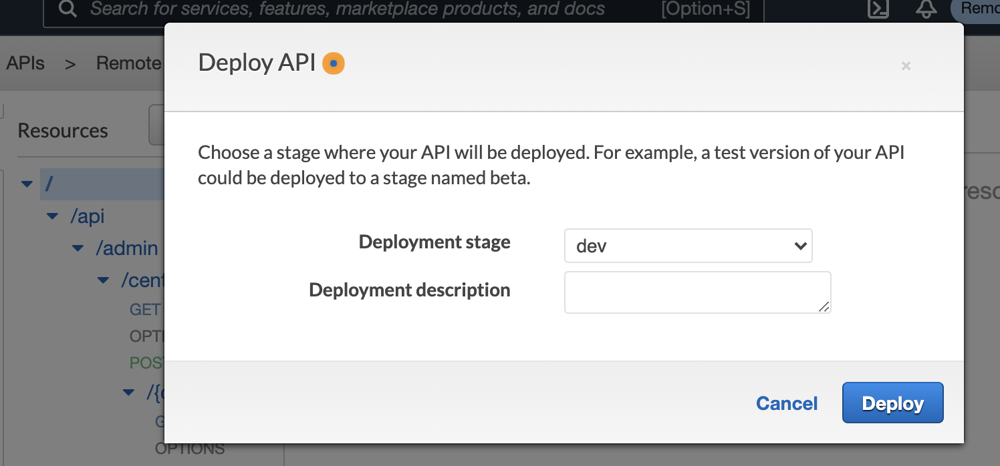
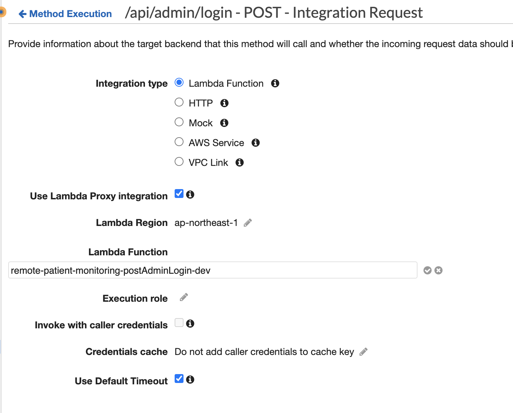

# Set up environment

## install dependencies

* Serverless
* node version 12.x
* jq
* sed

### 1. Setup aws-cli

Follow [this AWS instruction](https://docs.aws.amazon.com/ja_jp/cli/latest/userguide/install-cliv2.html)

Set AWS profile

```bash
aws configure --profile your-profile-name
export AWS_PROFILE="your-profile-name"
```

### 2. Install Serverless environment

`npm install`

### 3. Edit environment settings

リージョン毎に一意なので、Bucket名とドメイン名は変えて下さい。
また、AdminUserEmail も変更してください。

config/dev.json

```bash
{
  "AuthAdminUserPoolDomain":"your-api-domain-admin",
  "AuthNurseUserPoolDomain":"your-api-domain-nurse",
  "AuthPatientUserPoolDomain":"your-api-domain-patient",
  "AuthAdminUserPoolDomain":"your.api.domain",
  "OauthCallbackURL":"https://your.callback.url",
  "OauthSignoutURL":"https://your.signout.url",
  "Bucket":"your-bucket-name",
  "DebugMode":"on"
  "DBPrefix":"RemotePatientMonitoring-",
  "AdminUserEmail":"hal@code4japan.org",
  "AdminUserName":"admin"
}
```

### 4. Setup

Dynamo DB のセットアップと、Lambda Function 及び API Gateway の作成の２種類の CloudFormation Stack を作成します。

全て一度で deploy する場合

```bash
npm run deploy
```

DynamoDB 以外を deploy する場合

```bash
npm run deploy:all-gateway
```

※初回のデプロイ時のみ、API Gateway の Authorization の CLIENT_POOL のIDを設定するため、以下の手順で2回 deploy をしてください。

```bash
npm run deploy && npm run deploy:gateway
```

### 5. Confirm admin user

`util/.secret.json` というファイルを作り、以下の内容を設定してください。

```json
{
  "auth_user":"admin(dev.json で設定したものと同じ)", 
  "auth_pass":"設定したいパスワード"
}
```

`config/dev.json` にセットしたメールアドレスに、仮パスワードを届いていると思います。
それを使って、下記コマンドでユーザを有効にしてください。

```bash
npm run confirmAdmin -- -c '仮パスワード' 
```

`.secret.json` で設定されたパスワードで、Auth用ユーザの Confirmation がされます。

最後に IdToken が表示されますので、コピーしておいてください。（ステップ6で使います）


### 6, run Test


以下のコマンドを叩くと、E2E テスト(`/test/e2e/fullspec.test.ts`) が実行されます。
まだ実装されていないテストは、`skip` してあります。

```bash
npm run test
```

Network Error が出る場合、以下を試してみてください。
get Authkey(`/api/admin/login`) が失敗するとその後のテスト全て失敗するので、そこから最初にチェックするのが良いと思います。

API を deploy する



上記でも Network Error が出る場合、該当APIの lambda の管理画面で `Environment variables` を選び、AWS KMS Key の設定を一度適当なKeyに変えてから、`default` に戻してください。


lambda はうまくいくけれと Network Error が出る場合、API Gateway から該当の API を選び、Test を行ってみてください。 `Invalid permissions on Lambda function` で失敗する場合、`Integration Request` の設定で、再度 lambda function をチェックし直してみてください。



### 7. Swagger UI にアクセスする

以下のコマンドで、Swagger UI が開きます。step5 で作ったユーザ名/パスワードでログインできます。

```bash
npm run openSwaggerUI
```

Authorize が必要なAPIにアクセスする場合、`Authorize` ボタンから、ステップ5で取得した、`IdToken` の内容を入力する必要があります。

SwaggerUIからAPIを叩いてもうまくいかない場合があります。その場合、AWS の console から、Lambda に Swagger にあるパラメータを渡してtestを直接実行してみてください。それでもエラーになる場合は、Lambda 実行時の認証情報がおかしくなっているケースが多いです。Step 6 の方法を試してみてください。


## 開発用情報

### E2E テストを実行する

以下のコマンドを叩くと、`/test/e2e/fullspec.test.ts` が実行されます。
まだ実装されていないテストは、`skip` してあります。

```bash
npm run test
```

ファイルの変更をウォッチしたい場合

```bash
npm run test:watch
```


### local development

#### ローカル環境での DynamoDB のインストール

Dynamo DB をインストールする

```bash
sls dynamodb install
```

#### DynamoDB のローカルインスタンスを開始

```bash
npm dynamodb:start
```

#### function をコマンドラインから実行する

```bash
# getCenters の実行
serverless invoke local --function getCenters
# path parameter を渡す
serverless invoke local --function getCenter --data '{ "pathParameters": {"centerId":"c2c43259-2708-4f4f-98d4-d57f72ecac70"}}'
# body データを渡す
serverless invoke local --function postCenter --data '{ "body":{"centerName":"test4"}}'
# 両方渡す場合
serverless invoke local --function putCenter --data '{ "pathParameters": {"centerId":"ccbcebd7-3186-43c2-9cc0-ff6e83ed9dd8"}, "body":{"centerName":"mycenter1"}}'
```

### deploy

#### API や serverless.yml を修正後、再デプロイする

```bash
npm run deploy:gateway
```

## アンインストール

### 全て削除

```bash
npm run remove:all
```

### 全て削除して再インストール

```bash
npm run redeploy-all
```

### APIのみ削除する

```bash
npm run remove:gateway
```

### DynamoDB のみ削除する

```bash
npm run remove:dynamodb
```
